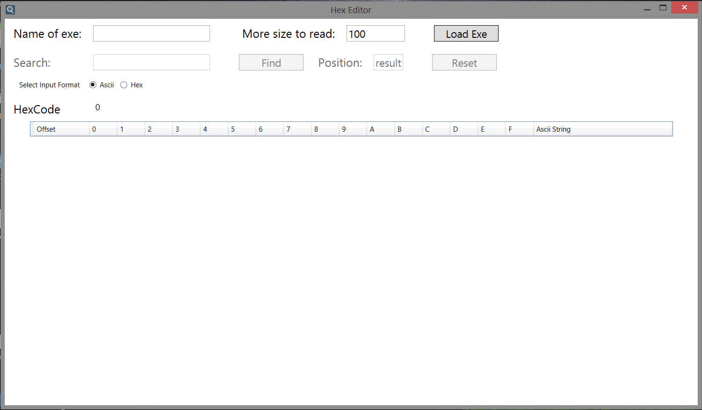

# Hex Editor

It is use to display data of exe. In addition we can search the keyword by given input in ASCII as well as Hex decimal.

- __Framework:__ Dot Net.
- __Front End:__ Windows Presentation Foundation (WPF)
- __Back End:__ C#.
- __Platform:__ Windows.

---

## Features

- Display only required data, not whole exe file.
- Highlight the position where the given keyword found.
- Mostly all exception are handle.
- Use of multithreading. So the GUI is not hang at the time of loading data.

---
## Project ScreenShot

1. First Look of HexEditor. 

Load button is disable. Enable when we give exe name.

---

2. After Loading Data

Here we have display 200 * 16 data. Row is continuous adding asynchronous.

---

3. Searching ASCII value

When Keyword is found starting position is display in Position textbox. And Highlight the position where keyword is present.

---

4. Searching Hex value

When Keyword is found starting position is display in Position textbox. And Highlight the position where keyword is present.

---

5. Keyword Not Found

When Keyword is not found it only display “not found” in Position textbox.

---

6. If Given is present in Exe but we have display small amount of data

So, It only mention the starting position where the data present and not highlight

---

7. Display more data

We can display more data by mention size of data in
‘More size to read’ textbox and click load button. Where I have display 1000*16 more data. Offset is display beside the Hexcode label

---

8. Reset Button

If you seen after clicking ‘LoadExe’ button the ExeName textbox is disabled. So you can’t Loaded another exe data. So reset button is provided to clear all the data. Reset will not perform if data loading into table is running.

---
---